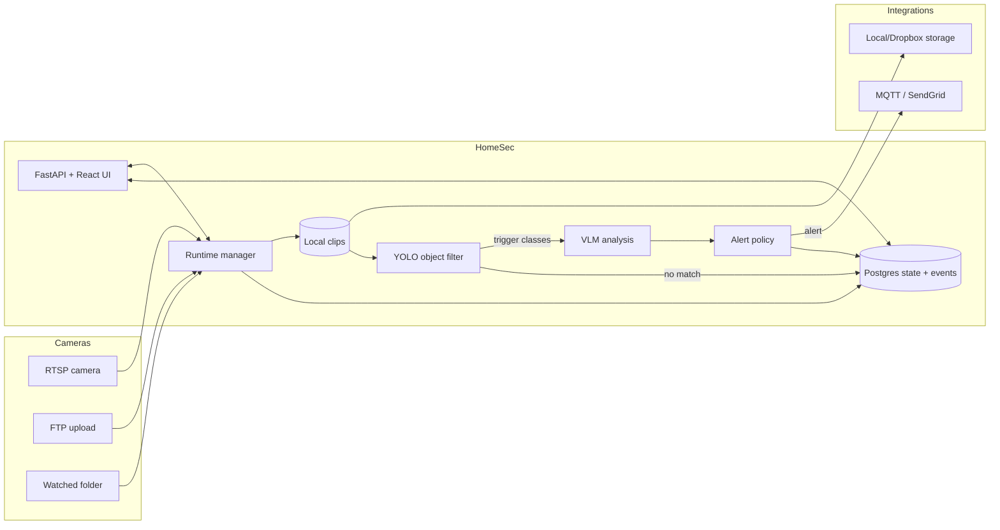

# HomeSec

[](https://pypi.org/project/homesec/)
[](LICENSE)
[](https://www.python.org/)
[](https://peps.python.org/pep-0561/)
[](https://codecov.io/gh/lan17/homesec)

**Local-first AI security cameras for people who want smarter alerts without handing their footage to a vendor cloud.**

HomeSec is a self-hosted camera system and video intelligence pipeline. It can watch live RTSP feeds, capture motion events, filter noisy clips with object detection, ask an OpenAI-compatible vision model what happened, and send policy-driven alerts only when something matters. Footage stays local by default; cloud storage, VLM calls, and notifications are explicit opt-ins.

> **Status:** HomeSec is an alpha-stage home-lab project. It is designed for trusted local networks, VPNs, and carefully managed self-hosted deployments. Enable API-key auth and put it behind your own access controls before exposing it outside your LAN.

## Why HomeSec?

- **High-signal alerts** — YOLO filters boring motion before VLM analysis, then alert policy decides what deserves a notification.
- **Local-first privacy** — raw clips are written locally first; Dropbox, OpenAI-compatible VLMs, MQTT, and email are all configurable integrations.
- **Self-serve control plane** — a FastAPI backend serves a React UI for setup, live view, events, camera settings, health, stats, and backups.
- **Real camera support** — RTSP motion recording, FTP uploads, watched folders, ONVIF discovery/preflight, live HLS previews, and experimental push-to-talk paths.
- **Hackable by design** — sources, filters, storage, VLM analyzers, alert policies, and notifiers are plugins with typed config boundaries.

## What it does

| Area | Capabilities |
| --- | --- |
| Camera ingest | RTSP motion recording, FTP uploads, local folder watching |
| Live view | On-demand HLS previews for RTSP sources, with UI cards for each camera |
| Event intelligence | YOLO object filtering, VLM scene analysis, risk/activity classification |
| Alerts | Per-camera policy overrides, MQTT for Home Assistant/Node-RED, SendGrid email |
| Storage | Local filesystem or Dropbox, with clip/event state tracked in Postgres |
| Operations | React setup wizard, config validation, runtime reloads, health/stats APIs, Postgres backups |
| Advanced camera control | ONVIF setup/probing and push-to-talk support for compatible RTSP/Tapo cameras |

## Quickstart: Docker Compose

Docker Compose is the easiest way to run HomeSec with the bundled FastAPI server, React UI, and Postgres.

```bash
git clone https://github.com/lan17/homesec.git
cd homesec

cp .env.example .env
cp config/example.yaml config/config.yaml

# Edit at least one camera URL and any provider secrets.
$EDITOR .env
$EDITOR config/config.yaml

docker compose up -d --build
```

Then open:

```text
http://localhost:8081
```

Useful follow-up commands:

```bash
docker compose logs -f homesec
docker compose down
```

The example config includes RTSP, FTP, local folder, Dropbox, MQTT, SendGrid, YOLO, OpenAI-compatible VLM, preview, and backup settings. Disable anything you do not use; notifiers are optional.

## Quickstart: Python package

The Docker image is the recommended path for the bundled web UI because it ships with built React assets. Direct package installs are useful for custom deployments, source development, or runtime/API-only packaging where you control `server.ui_dist_dir`.

```bash
pip install homesec
curl -O https://raw.githubusercontent.com/lan17/homesec/main/config/example.yaml
curl -O https://raw.githubusercontent.com/lan17/homesec/main/.env.example
mkdir -p config
mv example.yaml config/config.yaml
mv .env.example .env

# Set DB_DSN, camera URLs, and provider secrets in .env.
homesec validate --config config/config.yaml
homesec run --config config/config.yaml
```

If you run from a source checkout and want the web UI, build it first with `make ui-install && make ui-build` or set `server.ui_dist_dir` to an existing UI build. If the configured file is missing, `homesec run` starts the API/UI in bootstrap mode so you can use the setup wizard.

## Web UI

The backend serves the built UI on the same port as the API. The UI is organized around the daily operator loop:

- **Live** — watch configured cameras, start previews, use push-to-talk where supported, and jump to recent events.
- **Events** — browse clips, filter by camera/detection/alert state, and inspect VLM summaries and media.
- **Settings** — add or edit cameras, storage, detection, VLM, alert policy, and notifiers with secret-safe config handling.
- **System** — check health, daily stats, runtime uptime, camera status, and Postgres backup status.
- **Setup** — first-run wizard for cameras, storage, detection, notifications, review, and launch.

UI development notes live in [`ui/README.md`](ui/README.md).

## How the pipeline works


```mermaid
flowchart LR
    subgraph Cameras
        RTSP[RTSP camera]
        FTP[FTP upload]
        Folder[Watched folder]
    end

    subgraph HomeSec
        API[FastAPI + React UI]
        Runtime[Runtime manager]
        Clips[(Local clips)]
        DB[(Postgres state + events)]
        Filter[YOLO object filter]
        VLM[VLM analysis]
        Policy[Alert policy]
    end

    subgraph Integrations
        Storage[Local/Dropbox storage]
        Notify[MQTT / SendGrid]
    end

    RTSP --> Runtime
    FTP --> Runtime
    Folder --> Runtime
    API <--> Runtime
    API <--> DB
    Runtime --> Clips
    Runtime --> DB
    Clips --> Storage
    Clips --> Filter
    Filter -->|trigger classes| VLM
    Filter -->|no match| DB
    VLM --> Policy
    Policy -->|alert| Notify
    Policy --> DB
```

A clip is written locally first, then upload and filtering run in parallel. If the filter sees a configured trigger class, HomeSec sends sampled frames to the VLM. The alert policy combines VLM risk/activity output with per-camera overrides before notifying. Postgres records clip state and events for the UI and operational visibility.

## Configuration

HomeSec configuration is YAML-based and validated with Pydantic. Secrets should be referenced via environment variables instead of committed to YAML.

```yaml
cameras:
  - name: front_door
    source:
      backend: rtsp
      config:
        rtsp_url_env: FRONT_DOOR_RTSP_URL
        output_dir: ./recordings

storage:
  backend: local
  config:
    root: ./storage

notifiers:
  - backend: mqtt
    config:
      host: localhost
      topic_template: homecam/alerts/{camera_name}

filter:
  backend: yolo
  config:
    classes: [person, car, dog, cat]
    min_confidence: 0.5

vlm:
  backend: openai
  trigger_classes: [person]
  run_mode: trigger_only
  config:
    api_key_env: OPENAI_API_KEY
    model: gpt-4o

alert_policy:
  backend: default
  config:
    min_risk_level: medium
    notify_on_activity_types: [person_at_door, delivery, suspicious]
```

See [`config/example.yaml`](config/example.yaml) for the full reference example and [`docs/preview-deployment.md`](docs/preview-deployment.md), [`docs/postgres-backups.md`](docs/postgres-backups.md), and [`docs/push-to-talk.md`](docs/push-to-talk.md) for deployment-specific notes.

### Security and privacy notes

- Keep camera credentials and API tokens in `.env`, then reference them with `*_env` fields.
- HomeSec binds to `0.0.0.0:8081` by default so Docker/LAN access works. Treat that as a trusted-network service unless you add your own perimeter controls.
- API-key auth is available with:

  ```yaml
  server:
    auth_enabled: true
    api_key_env: HOMESEC_API_KEY
  ```

- VLM analysis sends selected frames to the configured OpenAI-compatible endpoint only when `vlm.run_mode` and `trigger_classes` allow it.
- Push-to-talk microphone audio is streamed for the active talk session and is not intentionally persisted; camera compatibility still varies by model/firmware.

## Built-in integrations

| Type | Built-ins |
| --- | --- |
| Sources | [`rtsp`](src/homesec/sources/rtsp/core.py), [`ftp`](src/homesec/sources/ftp.py), [`local_folder`](src/homesec/sources/local_folder.py) |
| Filters | [`yolo`](src/homesec/plugins/filters/yolo.py) |
| Storage | [`local`](src/homesec/plugins/storage/local.py), [`dropbox`](src/homesec/plugins/storage/dropbox.py) |
| VLM analyzers | [`openai`](src/homesec/plugins/analyzers/openai.py) |
| Notifiers | [`mqtt`](src/homesec/plugins/notifiers/mqtt.py), [`sendgrid_email`](src/homesec/plugins/notifiers/sendgrid_email.py) |
| Alert policies | [`default`](src/homesec/plugins/alert_policies/default.py), [`noop`](src/homesec/plugins/alert_policies/noop.py) |

## Extending HomeSec

HomeSec is built around strict interfaces and runtime plugin discovery. Each major capability is replaceable:

- `ClipSource` for new camera/event sources
- `ObjectFilter` for different detectors
- `StorageBackend` for S3, NAS, or custom retention behavior
- `VLMAnalyzer` for local or hosted multimodal models
- `AlertPolicy` for custom notification rules
- `Notifier` for chat, paging, automations, or smart-home integrations

See [`PLUGIN_DEVELOPMENT.md`](PLUGIN_DEVELOPMENT.md) for the complete plugin guide.

## CLI reference

```bash
homesec --help
homesec validate --config config/config.yaml
homesec run --config config/config.yaml
homesec cleanup --config config/config.yaml --older_than_days 7 --dry_run=False
```

## Development

```bash
git clone https://github.com/lan17/homesec.git
cd homesec
uv sync
make ui-install
make ui-build
make db
make run
```

Common checks:

```bash
make test
make typecheck
make lint
make ui-check
make check
```

The UI uses Vite + React + TypeScript and lives under [`ui/`](ui/). API client types are generated from the FastAPI OpenAPI contract.

For architecture notes, see [`DESIGN.md`](DESIGN.md). Some sections are intentionally deeper than the README and may describe historical design context.

## Contributing

Contributions are welcome, especially around camera compatibility, storage/notifier plugins, local model integrations, UI polish, and deployment docs.

1. Fork and clone the repository.
2. Create a focused branch.
3. Run the relevant tests/checks.
4. Open a pull request with the behavior change, validation, and any compatibility notes.

Found a bug or have a feature request? Please [open an issue](https://github.com/lan17/homesec/issues) with reproduction steps, environment details, and relevant logs.

## License

Apache 2.0. See [`LICENSE`](LICENSE).
