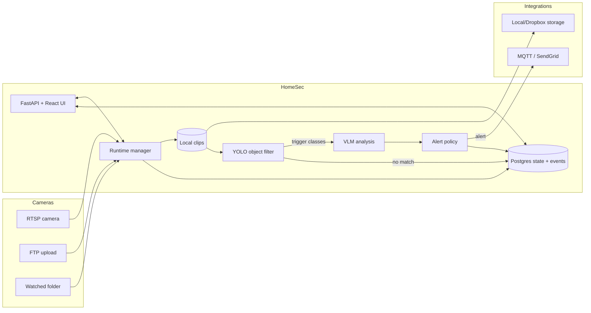

# HomeSec

[](https://pypi.org/project/homesec/)
[](LICENSE)
[](https://www.python.org/)
[](https://peps.python.org/pep-0561/)
[](https://codecov.io/gh/lan17/homesec)

**HomeSec helps your cameras tell you when something actually matters.**

Most home camera setups have the same two problems: they either bury you in motion spam, or they make you send your footage through someone else's cloud. HomeSec is a self-hosted alternative. It watches your cameras, records motion events, filters out boring clips, asks a vision model what happened when needed, and only alerts when the event looks worth your attention.

Footage is written locally first. Cloud storage, vision-model calls, MQTT, and email alerts are all things you choose to turn on.

> **Status:** HomeSec is still an alpha-stage home-lab project. It works best on trusted local networks or behind your own VPN/reverse proxy. If you expose it outside your LAN, enable API-key auth and put proper access controls in front of it.

## Why HomeSec?

- **Fewer useless alerts** — motion starts the pipeline, but YOLO and the alert policy decide whether a clip is actually interesting.
- **Your footage stays yours** — clips live locally by default, and cloud integrations are optional.
- **A web UI for the everyday loop** — check live feeds, review events, adjust settings, and see system health without SSHing into the box.
- **Works with normal IP-camera setups** — RTSP, FTP uploads, watched folders, ONVIF discovery/preflight, HLS preview, and experimental push-to-talk support.
- **Easy to tinker with** — swap in different sources, filters, storage backends, vision models, alert rules, or notification targets.

## What it does

| Area | What you get |
| --- | --- |
| Camera ingest | RTSP motion recording, FTP uploads, and local folder watching |
| Live view | On-demand HLS previews for RTSP cameras, shown as camera cards in the UI |
| Event review | A searchable event list with clips, detection results, VLM summaries, and alert decisions |
| Smarter alerts | Object filtering, vision-model analysis, per-camera policy overrides, MQTT, and SendGrid email |
| Storage | Local filesystem or Dropbox, with clip state and events tracked in Postgres |
| Day-to-day ops | Setup wizard, config validation, runtime reloads, health checks, stats, and Postgres backups |
| Camera extras | ONVIF setup/probing and push-to-talk paths for compatible RTSP/Tapo cameras |

## Quickstart: local Makefile

The quickest path is local-only: local folder ingest, local clip storage, no notifications, and VLM analysis disabled until you add an API key.

```bash
git clone https://github.com/lan17/homesec.git
cd homesec
make local
```

Then open:

```text
http://localhost:8081
```

`make local` does the boring setup for you:

- copies `.env.example` to `.env` if needed
- copies `config/local.yaml` to `config/config.yaml` if needed
- creates `recordings/inbox`, `storage`, and backup directories
- starts Postgres with Docker Compose
- installs/builds the React UI
- runs HomeSec with `config/config.yaml`

Drop a video file into `recordings/inbox` to exercise the pipeline, or edit `config/config.yaml` when you are ready to point HomeSec at a real RTSP/FTP camera.

Useful follow-up commands:

```bash
make local-setup       # create/update the local starter files without running
make db                # start only Postgres
make run               # run HomeSec against config/config.yaml
make down              # stop Docker Compose services
```

For a fuller deployment-style example, see [`config/example.yaml`](config/example.yaml). It shows RTSP, FTP, Dropbox, MQTT, SendGrid, OpenAI-compatible VLMs, live preview, push-to-talk, and backups.

## Web UI

The backend serves the built UI on the same port as the API. The main pages are:

- **Live** — watch configured cameras, start previews, use push-to-talk where supported, and jump to recent events.
- **Events** — review clips, filter by camera/detection/alert state, and inspect the media and VLM summary.
- **Settings** — add or edit cameras, storage, detection, VLM, alert policy, and notifiers.
- **System** — check health, daily stats, runtime uptime, camera status, and Postgres backup status.
- **Setup** — walk through cameras, storage, detection, notifications, review, and launch on first run.

UI development notes live in [`ui/README.md`](ui/README.md).

## How the pipeline works


```mermaid
flowchart LR
    subgraph Cameras
        RTSP[RTSP camera]
        FTP[FTP upload]
        Folder[Watched folder]
    end

    subgraph HomeSec
        API[FastAPI + React UI]
        Runtime[Runtime manager]
        Clips[(Local clips)]
        DB[(Postgres state + events)]
        Filter[YOLO object filter]
        VLM[VLM analysis]
        Policy[Alert policy]
    end

    subgraph Integrations
        Storage[Local/Dropbox storage]
        Notify[MQTT / SendGrid]
    end

    RTSP --> Runtime
    FTP --> Runtime
    Folder --> Runtime
    API <--> Runtime
    API <--> DB
    Runtime --> Clips
    Runtime --> DB
    Clips --> Storage
    Clips --> Filter
    Filter -->|trigger classes| VLM
    Filter -->|no match| DB
    VLM --> Policy
    Policy -->|alert| Notify
    Policy --> DB
```

A clip is saved locally first. Upload and object detection then run in parallel, so a storage hiccup does not stop detection and an empty clip does not waste a VLM call. If the detector sees one of your trigger classes, HomeSec samples frames for the vision model. The alert policy combines that result with your per-camera rules before sending notifications.

Postgres keeps the event history and clip state that power the UI. The pipeline is designed to degrade gracefully: camera footage is still written locally even when an external service is unavailable.

## Configuration

Configuration is YAML, validated with Pydantic. Put secrets in `.env`, then reference them from YAML with `*_env` fields.

```yaml
cameras:
  - name: front_door
    source:
      backend: rtsp
      config:
        rtsp_url_env: FRONT_DOOR_RTSP_URL
        output_dir: ./recordings

storage:
  backend: local
  config:
    root: ./storage

notifiers:
  - backend: mqtt
    config:
      host: localhost
      topic_template: homecam/alerts/{camera_name}

filter:
  backend: yolo
  config:
    classes: [person, car, dog, cat]
    min_confidence: 0.5

vlm:
  backend: openai
  trigger_classes: [person]
  run_mode: trigger_only
  config:
    api_key_env: OPENAI_API_KEY
    model: gpt-4o

alert_policy:
  backend: default
  config:
    min_risk_level: medium
    notify_on_activity_types: [person_at_door, delivery, suspicious]
```

See [`config/example.yaml`](config/example.yaml) for the full example. There are also focused notes for [`live preview`](docs/preview-deployment.md), [`Postgres backups`](docs/postgres-backups.md), and [`push-to-talk`](docs/push-to-talk.md).

### Security and privacy notes

- Keep camera credentials and API tokens in `.env`; do not commit them to YAML.
- HomeSec binds to `0.0.0.0:8081` by default so Docker and LAN access work. Treat it like a trusted-network service unless you add your own perimeter controls.
- API-key auth is available with:

  ```yaml
  server:
    auth_enabled: true
    api_key_env: HOMESEC_API_KEY
  ```

- VLM analysis only sends selected frames to the configured OpenAI-compatible endpoint when `vlm.run_mode` and `trigger_classes` allow it.
- Push-to-talk microphone audio is streamed for the active talk session and is not intentionally persisted. Camera compatibility still varies by model and firmware.

## Built-in integrations

| Type | Built-ins |
| --- | --- |
| Sources | [`rtsp`](src/homesec/sources/rtsp/core.py), [`ftp`](src/homesec/sources/ftp.py), [`local_folder`](src/homesec/sources/local_folder.py) |
| Filters | [`yolo`](src/homesec/plugins/filters/yolo.py) |
| Storage | [`local`](src/homesec/plugins/storage/local.py), [`dropbox`](src/homesec/plugins/storage/dropbox.py) |
| VLM analyzers | [`openai`](src/homesec/plugins/analyzers/openai.py) |
| Notifiers | [`mqtt`](src/homesec/plugins/notifiers/mqtt.py), [`sendgrid_email`](src/homesec/plugins/notifiers/sendgrid_email.py) |
| Alert policies | [`default`](src/homesec/plugins/alert_policies/default.py), [`noop`](src/homesec/plugins/alert_policies/noop.py) |

## Extending HomeSec

HomeSec is meant to be changed. The core pipeline talks to interfaces, and plugins provide the concrete behavior:

- `ClipSource` for new camera/event sources
- `ObjectFilter` for different detectors
- `StorageBackend` for S3, NAS, or custom retention behavior
- `VLMAnalyzer` for local or hosted multimodal models
- `AlertPolicy` for custom notification rules
- `Notifier` for chat, paging, automations, or smart-home integrations

See [`PLUGIN_DEVELOPMENT.md`](PLUGIN_DEVELOPMENT.md) for the full plugin guide.

## CLI reference

```bash
homesec --help
homesec validate --config config/config.yaml
homesec run --config config/config.yaml
homesec cleanup --config config/config.yaml --older_than_days 7 --dry_run=False
```

## Development

```bash
git clone https://github.com/lan17/homesec.git
cd homesec
uv sync
make ui-install
make ui-build
make db
make run
```

Common checks:

```bash
make test
make typecheck
make lint
make ui-check
make check
```

The UI uses Vite + React + TypeScript and lives under [`ui/`](ui/). API client types are generated from the FastAPI OpenAPI contract.

For architecture notes, see [`DESIGN.md`](DESIGN.md). It goes deeper than the README and includes some historical design context.

## Contributing

Contributions are welcome, especially around camera compatibility, storage/notifier plugins, local model integrations, UI polish, and deployment docs.

1. Fork and clone the repository.
2. Create a focused branch.
3. Run the relevant checks.
4. Open a pull request with what changed, how you tested it, and any compatibility notes.

Found a bug or have a feature request? Please [open an issue](https://github.com/lan17/homesec/issues) with reproduction steps, environment details, and relevant logs.

## License

Apache 2.0. See [`LICENSE`](LICENSE).
