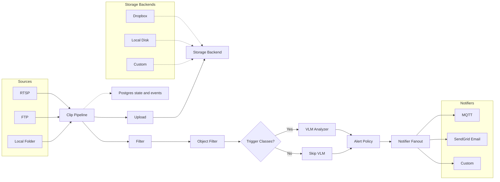
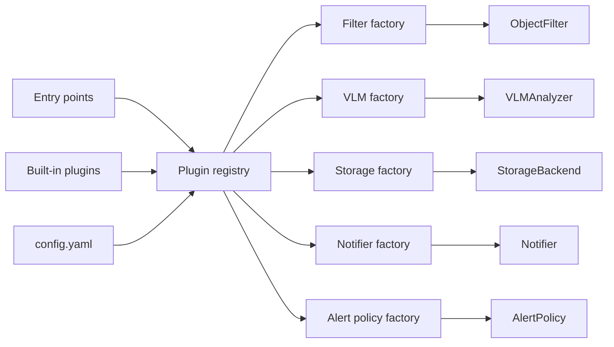

# HomeSec

[](LICENSE)
[](https://www.python.org/)
[](https://peps.python.org/pep-0561/)

HomeSec is a pluggable, async pipeline for home security cameras. It records
short clips, runs object detection, optionally calls a vision-language model
(VLM) for a structured summary, and sends alerts via MQTT or email. The design
leans toward reliability: clips land on disk first, state/event writes are
best-effort, and non-critical stages can fail without losing the alert.

## Highlights

- Bring your own input: RTSP motion detection, FTP uploads, or a watched folder
- Parallel upload + filter (YOLOv8) with frame sampling and early exit
- OpenAI-compatible VLM analysis with structured output
- Policy-driven alerts with per-camera overrides
- Fan-out notifiers (MQTT for Home Assistant, SendGrid email)
- Postgres-backed state + events with graceful degradation
- Built around small, stable interfaces so new plugins drop in cleanly
- Health endpoint plus optional Postgres telemetry logging

## Pipeline at a glance



```
ClipSource -> (Upload + Filter) -> VLM (optional) -> Alert Policy -> Notifier(s)
```

- Upload and filter run in parallel; VLM runs only when trigger classes are detected.
- Upload failures do not block alerts; filter failures stop processing.
- State is stored in Postgres (`clip_states` + `clip_events`) when available.

## Quickstart

### Requirements

- Python 3.10+ (newest available is best; 3.14 is fine if your deps support it)
- ffmpeg in PATH (required for RTSP source)
- Postgres for state/events (`make db-up` starts a local instance). The pipeline
  continues if the DB is down, but a DSN is still required.
- Optional: MQTT broker, Dropbox credentials, OpenAI-compatible API key

### Setup

1. Install dependencies:
   `uv sync`
2. Create a config file:
   - Start from `config/example.yaml` or `config/sample.yaml`
3. Set environment variables (use `.env.example` as a template):
   `cp .env.example .env`
4. Start Postgres:
   `make db-up`
5. Validate config:
   `uv run python -m homesec.cli validate --config config/example.yaml`
6. Run:
   `uv run python -m homesec.cli run --config config/example.yaml --log_level INFO`

Tip: `make homesec` loads `.env` and runs `config/production.yaml`.

## Configuration

Configs are YAML and validated with Pydantic. Start with any file in `config/`.

Minimal example (RTSP + Dropbox + MQTT):

```yaml
version: 1

cameras:
  - name: front_door
    source:
      type: rtsp
      config:
        rtsp_url_env: FRONT_DOOR_RTSP_URL
        output_dir: "./recordings"

storage:
  backend: dropbox
  dropbox:
    root: "/homecam"
    token_env: DROPBOX_TOKEN
    app_key_env: DROPBOX_APP_KEY
    app_secret_env: DROPBOX_APP_SECRET
    refresh_token_env: DROPBOX_REFRESH_TOKEN

state_store:
  dsn_env: DB_DSN

notifiers:
  - backend: mqtt
    config:
      host: "localhost"
      port: 1883

filter:
  plugin: yolo
  config:
    classes: ["person"]
    min_confidence: 0.5

vlm:
  backend: openai
  llm:
    api_key_env: OPENAI_API_KEY
    model: gpt-4o

alert_policy:
  backend: default
  enabled: true
  config:
    min_risk_level: medium

per_camera_alert:
  front_door:
    min_risk_level: low
    notify_on_activity_types: ["person_at_door", "delivery"]
```

A few things worth knowing:
- Secrets never go in YAML. Use env var names (`*_env`) and set values in your shell or `.env`.
- At least one notifier must be enabled (`mqtt` or `sendgrid_email`).
- Built-in YOLO classes: `person`, `bird`, `cat`, `dog`, `horse`, `sheep`, `cow`,
  `elephant`, `bear`, `zebra`, `giraffe`.
- Local storage for development:

```yaml
storage:
  backend: local
  local:
    root: "./storage"
```

- Set `alert_policy.enabled: false` to disable notifications (a noop policy is used).
- For a quick local run, pair `local_folder` with `local` storage and drop a clip
  into `recordings/`.

## Extensible by design

HomeSec is intentionally modular. Each major capability is an interface
(`ClipSource`, `StorageBackend`, `ObjectFilter`, `VLMAnalyzer`, `AlertPolicy`,
`Notifier`) defined in `src/homesec/interfaces.py`, and plugins are discovered at
runtime via entry points. This keeps the core pipeline small while making it
easy to add new backends without editing core code.

What this means in practice:
- Swap storage or notifications by changing config, not code.
- Add a new plugin type as a separate package and register it.
- Keep config validation strict by pairing each plugin with a Pydantic model.

Extension points (all pluggable):
- Sources: RTSP motion detection, FTP uploads, local folders
- Storage backends: Dropbox, local disk, or your own
- Filters: object detection (YOLO or custom models)
- VLM analyzers: OpenAI-compatible APIs or local models
- Alert policies: per-camera rules and thresholds
- Notifiers: MQTT, email, or anything else you can send from Python



## CLI

- Run the pipeline:
  `uv run python -m homesec.cli run --config config/example.yaml --log_level INFO`
- Validate config:
  `uv run python -m homesec.cli validate --config config/example.yaml`
- Cleanup (reanalyze and optionally delete empty clips):
  `uv run python -m homesec.cli cleanup --config config/example.yaml --older_than_days 7 --dry_run True`

## Built-in plugins

- Filters: `yolo`
- VLM analyzers: `openai` (OpenAI-compatible API)
- Storage: `dropbox`, `local`
- Notifiers: `mqtt`, `sendgrid_email`
- Alert policies: `default`, `noop`

## Writing a plugin

HomeSec discovers plugins via entry points in the `homesec.plugins` group. A plugin
module just needs to import and register itself.

Each plugin provides:
- A unique name (used in config)
- A Pydantic config model for validation
- A factory that builds the concrete implementation

```python
# my_package/filters/custom.py
from pydantic import BaseModel
from homesec.interfaces import ObjectFilter
from homesec.plugins.filters import FilterPlugin, filter_plugin

class CustomConfig(BaseModel):
    threshold: float = 0.5

class CustomFilter(ObjectFilter):
    ...

@filter_plugin(name="custom")
def register() -> FilterPlugin:
    return FilterPlugin(
        name="custom",
        config_model=CustomConfig,
        factory=lambda cfg: CustomFilter(cfg),
    )
```

```toml
# pyproject.toml
[project.entry-points."homesec.plugins"]
my_filters = "my_package.filters.custom"
```

## Observability

- Health endpoint: `GET /health` (configurable in `health.host`/`health.port`)
- Optional telemetry logs to Postgres when `DB_DSN` is set:
  - Start local DB: `make db-up`
  - Run migrations: `make db-migrate`

## Development

- Run tests: `make test`
- Run type checking (strict): `make typecheck`
- Run both: `make check`
- Tests must include Given/When/Then comments.
- Architecture notes: `DESIGN.md`

## License

Apache 2.0. See `LICENSE`.
