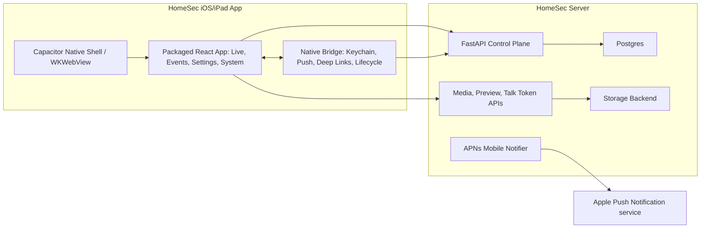

# HomeSec iOS and iPad App Design

Last reviewed: 2026-06-14

This document is the repo-level architecture baseline for the first HomeSec iOS
and iPad app. The v1 direction is to package the existing React app in a
Capacitor iOS shell and add narrow native bridges only where iOS capabilities
are required. The build runbook remains the operational source for signing,
device QA, APNs credentials, and App Store/TestFlight mechanics.

## Executive Decision

Build the first HomeSec iOS/iPad app as a Capacitor-based native shell around
the existing React app.

The app should not be a remote-only WebView pointed at a hosted HomeSec page.
It should be a native iOS app that loads the built React assets locally, talks
to a configured HomeSec server over HTTPS or VPN, and exposes native features
through explicit bridge modules.

The existing React app remains the canonical UI for v1:

- live camera view
- event list and event detail
- recorded clip playback
- camera/settings/setup/system screens
- current HLS preview and MP4 media flows
- current OpenAPI TypeScript client and TanStack Query hooks

## Locked Decisions

| Area | Decision |
| --- | --- |
| UI | Reuse the existing React app as the canonical product UI. |
| Native wrapper | Use Capacitor iOS. |
| Capacitor root | Use `ui/` as the Capacitor root. |
| Bundle ID | Use `com.levneiman.homesec`. |
| App name | Use `HomeSec`. |
| Distribution | Personal/internal use first, with room for future TestFlight or public release. |
| Remote access | Single configured server base URL for v1. HTTPS or VPN is recommended. |
| Auth entry | Manual server URL plus pasted HomeSec API token. QR pairing is deferred. |
| Auth disabled behavior | Show a strong warning, but do not hard-block first LAN/VPN iteration. |
| Token storage | Browser mode keeps existing session storage behavior. Native iOS mode must use Keychain. |
| Push notifications | Plain APNs first. Rich notification thumbnails are deferred. |
| Notification route | Open `/events/:clipId?from=notification`. |
| Alert review scope | `alerted == true` is enough. No alert-review or review-state work in this stream. |
| Mobile device registry | Named iOS devices with enable/disable semantics. |
| APNs config | Implemented as a notifier backend under `notifiers`, using `backend: apns_mobile`. |
| Push-to-talk | Keep React parity. Test the WebView path first; add native audio only if needed. |
| Background behavior | Stop live preview and push-to-talk when the app backgrounds. |
| iPad v1 | Same responsive app. No dedicated iPad split view in v1. |
| Face ID | Later milestone. App-level lock on launch/resume. |
| Local cache | Metadata/thumbnails only. No full clip cache by default. |
| Token revocation | Accept global shared-token rotation for v1. Per-device tokens are deferred. |
| Deep links | Custom scheme first. Universal links are deferred. |
| Custom URL scheme | Default to `homesec://`. |
| Privacy posture | No analytics, no third-party crash reporting, no cloud relay in v1. |

## Goals

The iOS app should provide feature parity with the current web app:

1. View live cameras.
2. Review events.
3. Play recorded clips.
4. See AI/VLM summaries, risk, activity type, and detected objects.
5. Navigate from notification to the relevant event.
6. Configure cameras/settings where the current web app supports it.
7. Preserve room for future alert review, dismiss/review state, tuning, and
   better VLM explainability without implementing those workflows in this stream.

The most important iOS-specific loop is:

```text
Notification received -> open HomeSec -> land on relevant event
-> understand what happened -> play clip -> move to next/previous event
```

## Non-Goals For V1

These should not block the first iOS app:

- multi-user RBAC
- OAuth, passkeys, or pairing/QR auth
- Face ID or Touch ID app lock
- HomeKit, Siri, or Apple Watch
- full native SwiftUI UI
- WebRTC live-view migration
- HomeSec-hosted cloud relay
- native iPad split-view UI
- rich notification thumbnails
- universal links
- alert tuning mutation workflows
- alert-review or review-state backend work

## Architecture



### Native Shell Responsibilities

The native iOS layer should stay small and own only capabilities that the web app
cannot safely or ergonomically own:

- load packaged React assets
- store and retrieve the API token from Keychain
- store and retrieve the server base URL
- register for APNs and send the device token to HomeSec
- receive notification taps and deep links
- forward routes into the React router
- stop active media sessions on app backgrounding
- later, gate app display through Face ID or Touch ID

### React Responsibilities

The React app remains the product surface:

- routing
- live view
- event list and event detail
- clip playback
- settings/setup/system screens
- API queries and mutations
- mobile layout and error states
- future alert-review UI, when that stream is explicitly in scope

### Backend Responsibilities

The backend remains the control plane:

- auth validation
- camera, event, config, setup, health, runtime APIs
- media, preview, and talk token APIs
- mobile device registry
- APNs notifier
- notification payload generation
- optional thumbnail/media signing later

## Auth Design

Current web auth uses a configurable single Bearer token. Browser UI currently
stores the token in `window.sessionStorage` under `homesec.apiKey`, and HTTP
requests send it as:

```http
Authorization: Bearer <token>
```

For v1 iOS, keep single-token auth but move persistent token storage into iOS
Keychain. The long-lived HomeSec API token must not be persisted in WebView
`sessionStorage` when running in native iOS mode.

Add provider abstractions:

```typescript
export interface AuthTokenProvider {
  getToken(): Promise<string | null>
  setToken(token: string | null): Promise<void>
  clearToken(): Promise<void>
}

export interface ServerBaseUrlProvider {
  getBaseUrl(): Promise<string | null>
  setBaseUrl(value: string): Promise<void>
  clearBaseUrl(): Promise<void>
}
```

Provider selection:

| Environment | Token provider | Base URL provider |
| --- | --- | --- |
| Browser web app | Existing `sessionStorage` key `homesec.apiKey` | Build-time `VITE_API_BASE_URL`, then optional runtime storage |
| iOS Capacitor app | Native bridge to Keychain | Native bridge to stored server URL |
| Tests | In-memory provider | In-memory provider |

Future pairing/QR auth should be designed separately and should not be added to
the v1 app shell.

The implemented native-mode setup path validates the entered server URL and API
token, then persists the server URL, API token, and auth-disabled acknowledgement
through the native Keychain bridge. Browser mode keeps the existing
session-storage behavior.

## iOS Setup UX

Native-mode first launch should support:

1. User enters server URL.
2. App calls `/api/v1/health`.
3. User enters HomeSec API token.
4. App validates the token against an auth-protected endpoint such as
   `/api/v1/cameras`.
5. App stores server URL and API token through the native Keychain-backed
   providers.
6. App routes to `/live`.

The setup screen must show actionable errors for invalid URLs and invalid tokens.
It must visibly warn for plain HTTP, and it must show a strong warning if auth
appears disabled. Existing browser `/setup` behavior must remain intact.

## Push And Deep-Link Design

Plain APNs notifications include an app route:

```json
{
  "aps": {
    "alert": {
      "title": "Driveway: person detected",
      "body": "High-risk event at 9:42 PM."
    },
    "sound": "default",
    "category": "HOMESEC_EVENT"
  },
  "type": "event_alert",
  "event_id": "clip_abc123",
  "camera": "driveway",
  "risk_level": "high",
  "activity_type": "person",
  "route": "/events/clip_abc123?from=notification"
}
```

Custom-scheme links should map like this:

```text
homesec://events/clip_abc123?from=notification
-> /events/clip_abc123?from=notification
```

If setup/auth is required first, React should preserve the pending route and
navigate after successful setup. Invalid routes should fall back safely to
`/live` or `/events`.

## Implementation Plan

### iOS M1 - App Shell MVP

Goal: get a native iOS shell opening the existing React app with runtime server
URL and API token support.

1. `iOS-00` - Add finalized iOS design doc to repo.
2. `iOS-01` - Introduce API environment and token-provider abstraction.
3. `iOS-02` - Make API client base URL runtime-configurable.
4. `iOS-03` - Add native-mode setup screen for server URL and API token.
5. `iOS-04` - Add Capacitor iOS scaffold rooted in `ui/`.
6. `iOS-05` - Add iOS native runtime detection.

### iOS M2 - Native Integration And Mobile UX

1. `iOS-06` - Implement iOS Keychain bridge for token and server URL.
2. `iOS-07` - Wire React auth provider to native Keychain in iOS mode.
3. `iOS-08` - Add app lifecycle handling for background/resume.
4. `iOS-09` - Add custom-scheme deep-link routing.
5. `iOS-10` - Safe-area and bottom-nav hardening.
6. `iOS-11` - Live preview iOS hardening.
7. `iOS-12` - Event detail notification-mode UX.

### iOS M3 - Plain Push Notifications

1. `iOS-13` - Add mobile device registry model and repository.
2. `iOS-14` - Add mobile device API routes.
3. `iOS-15` - Add iOS APNs registration in native app.
4. `iOS-16` - Register/update mobile device from React startup.
5. `iOS-17` - Implement `apns_mobile` notifier backend.
6. `iOS-18` - Notification tap opens event detail.

### iOS M4 - Personal Release Readiness

1. `iOS-19` - iOS device QA pass.
2. `iOS-20` - Personal release build notes.

## Validation Expectations

Use focused validation while developing, then run the relevant repo gates before
publishing or handing off:

```bash
make check
make ui-check
```

For M1 tickets that only touch docs, document if full checks are skipped. For
M1 tickets that touch UI runtime code, run the UI gate at minimum:

```bash
make ui-check
```

For the Capacitor scaffold and native bridge changes, also verify:

```bash
pnpm --dir ui ios:sync
xcodebuild \
  -project ui/ios/App/App.xcodeproj \
  -scheme App \
  -destination 'generic/platform=iOS Simulator' \
  -configuration Debug \
  CODE_SIGNING_ALLOWED=NO \
  build
```

Launching in the simulator is expected when local Xcode setup allows it.
Real-device signing uses the personal Apple Development team for Debug and a
distribution identity for Release/TestFlight.

## Deferred Follow-Ups

- rich notification thumbnails with a Notification Service Extension
- pairing/QR auth with revocable per-device tokens
- Face ID or Touch ID app lock
- universal links
- native AVPlayer or native audio bridge, only if WebView media UX is inadequate
