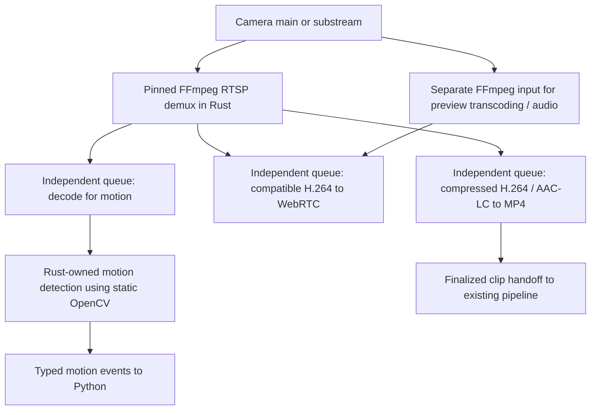

# Shared Rust camera media engine

Ticket: https://app.notion.com/p/3efd8336c59f8195b6b5c50c71c1d5e7

## Context
HomeSec now shares one Rust RTSP input per selected stream across eligible CPU H.264 motion, compressed H.264 recording with optional AAC-LC audio, and compatible video-only H.264 copy preview. The source-owned helper calls pinned FFmpeg 8.1.3 libraries for RTSP/TCP demuxing, decoding, frame preparation, and MP4 muxing; pinned, statically linked OpenCV 4.12.0 performs the existing detector's pixel operations. Python retains recording policy and clip delivery. Hardware motion, custom profiles, unsupported media, and preview transcoding/audio retain their existing FFmpeg paths.
Leonidas approved a shared Rust media pipeline after discussing compressed-packet sharing, Rust motion detection, optional Python frame delivery, and preserving recording reliability. Established codec libraries remain acceptable initially; an entirely pure-Rust codec stack is a separate evaluation.
The WebRTC foundation is merged in https://github.com/lan17/homesec/pull/109, and the native motion runtime is merged in https://github.com/lan17/homesec/pull/113. Completed HLS/session-ownership tickets remain historical context.

## Architecture
The existing RTSP source/runtime boundary remains the application-facing owner. A supervised camera-local Rust media component owns ingestion and bounded media consumers. Python keeps authorization, application policy, repository writes, upload, and analysis orchestration.

- Share one ingestion session per selected camera stream. Preserve main/substream selection; a low-resolution detection stream can cost less than decoding the main stream.
- Preserve compressed-video copying for recording. Do not force recording through decoded frames or preview transcoding.
- The Rust-owned OpenCV detector preserves current blur, threshold, percentage, reset, and recording-sensitivity semantics. Shared preview copies compressed video and does not need motion's prepared pixels. Reusing a preview encoder or delivering sampled Python frames remains later work.
- Python normally receives motion events, health, and completed clip references. Add bounded binary sampled-frame delivery only for a concrete analysis consumer; keep it separate from JSON control. Do not introduce C FFI between Python and Rust.
- Slow preview, motion, or Python consumers must not block recording. Each compressed-packet consumer has its own bounded queue; overflow fails that consumer rather than silently corrupting a recording or blocking other consumers. Motion's prepared-frame queue retains its existing drop-oldest behavior.
- Recording overload or storage failure must be explicit. Correct GOP boundaries, SPS/PPS changes, timestamps, audio synchronization, MP4 finalization/rotation, reconnects, cancellation, and process death are required before migrating recording.
- A shared worker introduces failure coupling. Keep preview encoding failures isolated from the recording path and retain per-camera supervision. Recording/upload must continue independently of Postgres.
- Credentials, SDP, media frames, and tokens are not logged or persisted as diagnostics. Expose stable bounded refusal/error codes and sanitized operational metadata.
- Codec implementations and packaging are distinct from orchestration. Evaluate existing native codec libraries and hardware support before selecting a binding; do not rewrite H.264/H.265/Opus codecs as a prerequisite.

## Plan
1. Native Rust ingest, first PR: replace FFmpeg ingestion for existing video-only H.264 copy-mode WebRTC preview. Reuse video_codec=copy and audio_enabled=false; other configurations retain existing behavior. Use a maintained RTSP client rather than hand-written auth/session logic. Deliver access units and SDP parameter sets to the existing str0m multi-viewer path through a bounded cancellable source adapter. Validate actual source codec/profile against negotiation; handle non-default RTP payload types and SDP-only SPS/PPS. No new UI/API configuration or recording changes.
2. Decode and Rust motion: feed the native encoded source into an established decoder; implement the current motion algorithm in Rust and compare behavior against fixtures from the Python/OpenCV implementation. Preserve reset, camera reconnect, sensitivity, stall grace, and recording policy. Emit typed observations through the existing source/runtime boundary.
3. Shared recording: add compressed packet fanout and recording muxing with independent consumer budgets. Validate keyframe starts, timestamps, audio, rotation, interrupted writes, and disk errors before switching production recording. Harden library-level RTSP control-response reads before coupling recording to this input. Keep a rollback path during migration. This stage is implemented below; production rollout remains separate.
4. Preview and Python reuse: share decode/encode work where compatible; allow sampled Python frames for an actual consumer. Support compatible H.264 passthrough and transcode other formats without compromising recordings.
5. Package and validate: reproducible supported-platform builds, required-codec capability checks, redacted errors, and a real-camera trial with recording, motion, and two viewers. Compare session counts, CPU/RSS, start time, and source-to-display latency against the current implementation.

## First PR acceptance
- A fake TCP RTSP camera feeds two encrypted WebRTC receivers through one RTSP PLAY session without invoking FFmpeg.
- SDP-only SPS/PPS and a payload type other than 96 are handled.
- Unsupported codec/profile is refused safely; disconnect, stall, explicit stop, and parent EOF release the camera session.
- Source startup/read cannot block helper control, authorization lease expiry, or shutdown.
- Python chooses native ingest only for supported copy/video-only configuration; transcode/audio paths remain covered.
- Existing recording and runtime regressions pass; run make check before publishing.

## Overall acceptance
- One input per selected stream serves concurrent consumers with measured session counts.
- Recording retains original compressed video and remains healthy when preview/Python is slow or absent.
- Motion behavior is validated against current fixtures; codec changes and real cameras are explicitly tested.
- The existing motion configuration and prepared grayscale frames produce the same Python and Rust observations and decisions. Preserve defaults, normalization, blur rounding/borders, threshold boundaries, reset behavior, and recording sensitivity.
- No claim of a fully FFmpeg-free stack or universal hardware acceleration without separate validation.

## Rust motion parity checkpoint
The private `native/webrtc/src/motion.rs` implementation preserves the existing grayscale detector's contract. The initial offline port used a custom Rust blur; runtime pixel operations now use pinned OpenCV 4.12.0. It takes explicit values for `pixel_threshold`, `min_changed_pct`, `blur_kernel`, and `recording_sensitivity_factor`; it introduces no operator settings or Rust defaults. Positive even kernels normalize to the next odd size, as in the RTSP source. The recording percentage override uses the existing division and zero-clamping behavior.

The detector calls OpenCV's accurate Gaussian blur with sigma zero and `BORDER_REFLECT_101`, followed by absolute difference, strict pixel thresholding, and changed-pixel counting. Borrowed input views last for one call; owned output buffers are reused and swapped only after successful processing. Arbitrary smaller kernel limits are not introduced; the implementation retains OpenCV's signed-32-bit kernel-size representation. Frame dimensions and total pixel count are bounded by OpenCV's signed-32-bit interfaces before allocation or counting.

`native/webrtc/tests/motion_parity.rs` compiles the private module directly and replays the committed corpus without regenerating expectations. It compares every blurred byte, changed count, percentage, motion decision, threshold override, and reset. Additional behavioral checks cover configuration constraints, even-kernel normalization, recording sensitivity, malformed frames, and shape changes. Malformed input preserves the previous baseline and observations; a stream shape change requires an explicit reset.

This checkpoint, merged in https://github.com/lan17/homesec/pull/112, validated the algorithm offline before runtime activation. It established the parity contract for input preparation and source lifecycle in the next stage.

## Native decoding and motion runtime
The motion helper uses pinned `ffmpeg-next` bindings to bundled FFmpeg 8.1.3 decode and filter libraries, plus exact `opencv` 0.101.0 bindings to OpenCV 4.12.0. The shared native build recipe verifies both source archives and statically links private FFmpeg, OpenCV `core`/`imgproc`, and bundled zlib libraries into the helper. Native OpenCV version/checksum metadata lives in Cargo.toml; header checks and the linked-version parity test enforce the pin. It prepares the same 320x240 grayscale frames at 10 fps, then feeds the Rust-owned detector with Python's validated motion configuration. It uses the existing motion settings rather than adding another user configuration or Rust defaults. Rust reports typed observations over the private control pipe; raw frames are not included in JSON.

The existing RTSP source owns and supervises the helper for its selected main/substream. Motion does not depend on preview viewers. Eligible CPU H.264 inputs prefer native motion. Hardware decoding, custom FFmpeg flags, unsupported inputs, or an unavailable helper retain the existing FFmpeg/OpenCV implementation. Native failure detaches its input before compatibility fallback. A first-frame timeout at the existing read/readiness deadline also selects compatibility input, preventing repeated native restarts before a long-GOP camera becomes decodable. Once a frame has been consumed or discarded for readiness, missing input retains the existing stall/reconnect policy. Prepared frames use the existing drop-oldest queue before detection; only Python-consumed frames advance the baseline, and reconnect readiness discards remain separate from detection. Each read carries the source-selected idle or recording threshold. Control output has a bounded write deadline so an abandoned parent cannot retain the camera session. Python continues to own recording lifecycle, sensitivity selection, reconnect/stall policy, and clip delivery to the existing pipeline.

The motion-only stage merged in https://github.com/lan17/homesec/pull/113 used independent inputs. Shared recording now uses the same pinned FFmpeg libraries for demuxing and muxing, as described below. FFmpeg and ffprobe command-line tools remain necessary for preflight and compatibility paths. Build and platform prerequisites are documented in [the operator notes](webrtc-preview.md#local-development-and-python-installations).

## Shared input and recording

`SharedMediaSession` lives behind the existing RTSP source boundary and lazily supervises one `homesec-webrtc --shared` process. Python and Rust exchange typed control requests, motion observations, and recording status over private pipes; compressed packets and decoded pixels stay in Rust. Source cleanup owns helper shutdown. Stopping motion or preview detaches that consumer; the input remains open while recording or another consumer still needs it. The final consumer releases the RTSP session.

The helper supports at most two selected stream URLs and two simultaneous recording IDs, allowing the existing policy to overlap the old and new clips during rotation. Matching URLs share one RTSP PLAY; choosing a separate detection substream preserves two inputs. Each recording, motion, and preview consumer receives an independent queue of at most 16 compressed packets. Audio is queued only for recordings that request it. Queue overflow records a stable failure for that consumer, without waiting for it or stopping healthy recording consumers. An actual camera/input failure necessarily affects all consumers of that URL.

Shared ingestion uses the pinned FFmpeg RTSP/TCP demuxer. Setup and reads use the existing source's configured connect and I/O deadlines. Metadata becomes available at the first complete timestamped IDR; actual in-band SPS/PPS replace stale initial SDP values when present. A newly attached recording or preview waits for a complete keyframe rather than beginning midway through a GOP. Native recordings preserve copied H.264 packets, distinct PTS/DTS, positive packet durations, and the demuxer's audio/video clock offset using one clip epoch. B-frames can be copied into MP4, although copy preview still requires a browser-compatible stream without B-frames.

Native recording accepts the existing canonical MP4 copy profiles with H.264 and either no audio or ordinary AAC-LC. Audio codec parameters are retained when motion first opens an input, allowing an AAC recording to join that same input later. Custom input/output flags, wall-clock timestamp profiles, other codecs or AAC extensions, and audio transcoding use the selected FFmpeg recording profile. Shared mode is selected only for eligible CPU sources; hardware motion configurations retain the existing separate-input path. A native recording failure selects compatibility recording for subsequent clips with that profile rather than repeatedly failing the same native path. No new recording or motion settings are introduced.

The muxer creates `<final-name>.partial` without replacing an existing file, waits for a real IDR, and rejects invalid timing, changed SPS/PPS, oversized packets, or write errors. Stop drains the accepted packet queue, writes the MP4 trailer, flushes, and syncs the file. Only then does the worker atomically publish the final name without overwriting it and report successful finalization. Python requires that confirmation before clip callbacks on normal stop, health failure, or rotation. Lost startup/stop replies retain ownership of the uncertain recording ID; compatibility recording cannot start until the writer is confirmed closed or the owned helper's death is confirmed. Retiring an unresponsive shared helper also interrupts its other consumers, which then follow the existing source recovery policy.

Startup succeeds only after the first validated IDR is written. Python keeps the old clip recording through the new clip's keyframe wait. Rotation begins at the configured duration; the old clip can include that bounded GOP wait. The next clip's policy clock starts when its recorder is ready.

These are conventional MP4 files, not a crash-recoverable fragmented format. A forced kill or failed mux leaves a `.partial` file that is excluded from clip handoff and replay. It is retained for operator inspection or cleanup, without a promise that it is playable. An orderly helper shutdown can finalize accepted packets, but an absent finalization reply does not produce an immediate callback. Finalized files retain the existing local replay path.

Compatible `video_codec: copy` / `audio_enabled: false` preview shares the selected native input and preserves the existing authorization leases, viewer budget, recording-priority policy, and camera preflight refusal behavior. Preview transcoding, audio conversion to Opus, HLS, and push-to-talk still use their established paths. Consequently shared ingestion does not guarantee a single camera session for every configuration.

## Implementation Log
- 2026-10-03: Leonidas authorized this architecture and staged implementation in a new PR. Inspected existing source, motion, recording, WebRTC, build, tests, and prior Notion tickets. Created branch codex/shared-rust-media from current main after verifying the WebRTC PR is merged. First milestone is native H.264 video-only preview ingestion; later milestones remain planned.
- 2026-10-03: Implemented native RTSP/TCP ingest behind the existing copy/video-only selector, shared with WebRTC viewers through bounded media assembly and queues. Reviewed startup/cancellation and source-profile negotiation; a mixed receiver-level regression now verifies selection of the compatible offered codec. Added real fake-camera delivery, stall, cleanup, and media-loss coverage.
- 2026-10-04: Native preview ingest and motion characterization merged into main in https://github.com/lan17/homesec/pull/110 and https://github.com/lan17/homesec/pull/111. Leonidas confirmed that Rust motion must preserve the existing algorithm and configuration. Implemented the private grayscale port and frozen-corpus replay on `codex/rust-motion-parity`; decoder/runtime integration and shared recording remain subsequent deliveries.
- 2026-10-05: Following the motion parity merge, Leonidas approved FFmpeg native libraries from Rust and native motion by default with compatibility fallback. The runtime stage on `codex/rust-motion-runtime` adds a source-owned motion helper and bundled FFmpeg decoding/filtering; Python recording policy and FFmpeg recording remain in place. Local development, CI, and Docker use one private static FFmpeg 8.1.3 build recipe; developer setup checks the compiler tools and libclang prerequisites before preparing the project.
- 2026-10-05: Leonidas selected the tested OpenCV candidate with reusable Rust buffers and required an exact native pin and static linking. The motion worker now calls OpenCV 4.12.0 through pinned 0.101.0 Rust bindings; one shared native build wrapper compiles both verified dependencies in temporary storage. Existing motion configuration, source/runtime boundaries, recording policy, and compatibility fallback are preserved.
- 2026-10-06: After merging https://github.com/lan17/homesec/pull/113, Leonidas approved pinned FFmpeg library demuxing for shared recording. The shared helper now fans compressed packets out to native motion, copied MP4 recording with AAC-LC support, and compatible video-only copy preview. Python retains policy, profile fallback, and finalized clip handoff. Local IPyCam validation exercised motion, two encrypted viewers, overlapping rotation, and independent consumer stops; production Lenovo was not accessed for this stage.

## Validation
`make check` covers Python tests, UI tests, Rust unit and encrypted-media integration tests, strict typing, formatting, lint, lockfile validation, and the UI build. Tests use synthetic camera media and an isolated disposable local Postgres instance. Real-camera rollout remains a separate milestone; production Lenovo and its database were not changed for shared recording validation.

The motion-runtime checkpoint merged in https://github.com/lan17/homesec/pull/113 passed all 62 native tests on macOS ARM64 and Debian Bookworm ARM64, including same-build CLI preparation parity, the 24-case frozen motion corpus, reusable-input ownership, native size limits, and camera/process lifecycle checks. Its full `make check` also passed 1,550 Python and 325 UI tests, application/bootstrap strict typing, lint/formatting, lockfile validation, generated API checks, and the UI build. Seventeen bootstrap tests covered both archive pins, Cargo metadata validation, safe extraction, private discovery, parallelism, concurrent cache publication, incomplete/shared-library cache repair, failure cleanup, and license copying.

The same motion-runtime checkpoint validated the exact Docker helper-builder downloading and verifying both pinned sources without system OpenCV or FFmpeg development packages. macOS/Linux loader inspection confirmed there were no dynamic OpenCV, libav, or zlib dependencies; standard platform runtime libraries remained dynamic. The macOS helper and frozen detector suite executed with all `DYLD_*` overrides removed. Both executables also ran in the pristine Python 3.14 Bookworm runtime base with only the standard C++ runtime added: all 11 detector tests passed without OpenCV, FFmpeg, libav, libclang, or private native build libraries installed. The full application image and production camera trial remain separate validation steps.

The shared runtime's synthetic tests exercise one RTSP PLAY with motion, overlapping recordings, and two encrypted receivers; decoding completed clips; input lifetime after consumer stops; configured preview timeouts; publication collisions; partial files after forced termination; and orderly EOF cleanup. The recording oracle checks copied H.264/AAC payloads, distinct B-frame timestamps, packet durations, deliberate audio/video offsets, and independently decoded video/audio. Source tests cover stale SDP parameter sets and bounded RTSP response reads. Python boundary tests verify fallback profiles and clip handoff only after successful finalization.

The owned local IPyCam trial used 1280x720 CPU H.264 at 15 fps. Two overlapping MP4 clips and samples from both encrypted preview viewers decoded successfully. Motion and preview could be stopped independently while the remaining recording stayed active, and successful rotation left no `.partial` files. A subsequent real source-factory trial delivered three rotated clips of 121 frames each plus a short shutdown clip to temporary storage. Adjacent clips shared their boundary IDR, proving continuous recording; every stored copy matched and decoded. These local results do not establish production camera behavior, physical iOS playback, or a universal latency/CPU improvement.

## Library and resource limits

The earlier Retina adapter limitation is now hardened in the pinned builds. The private Retina 0.4.20 patch caps aggregate RTSP headers/body at 256 KiB during incremental reads. The verified FFmpeg source recipe applies the same 256 KiB RTSP response limit before body allocation, and caps accumulated H.264 parser access units at 2 MiB before combining fragments. Consumer packets are capped at 2 MiB, codec extradata at 64 KiB, and each native clip is capped below one million accepted packets to limit MP4 sample-table growth. A recording with unsupported packets or exceeded recording limits fails explicitly and does not publish a clip.

These limits bound specific buffers and queues; they do not provide a hard bound on the entire process, codec allocations, or total recording size. Cameras remain operator-configured LAN/VPN sources. Native library patches, verified source pins, and static linkage are part of the shared build recipe; using an arbitrary system FFmpeg library would bypass those guarantees.

## Links
- WebRTC foundation: https://github.com/lan17/homesec/pull/109
- Related completed RTSP ownership work: https://app.notion.com/p/340d8336c59f8166ad71ff93ce78517d
- Related completed RTSP fanout epic: https://app.notion.com/p/341d8336c59f812595cbdc184c4092ac
- RTSP library: https://github.com/scottlamb/retina
