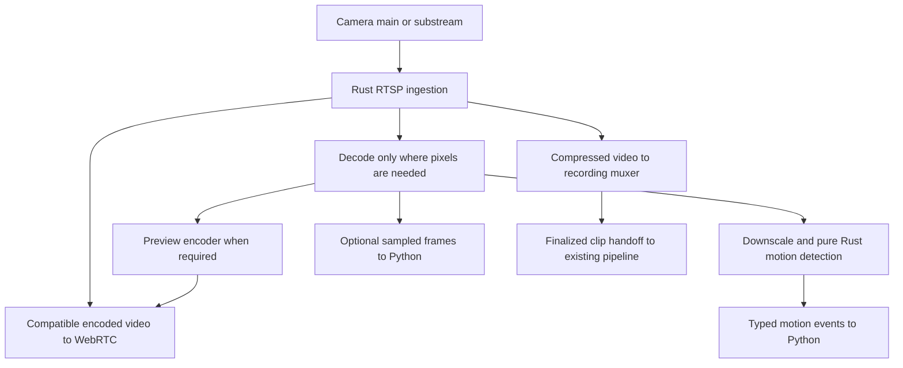

# Shared Rust camera media engine

Ticket: https://app.notion.com/p/3efd8336c59f8195b6b5c50c71c1d5e7

## Context
HomeSec currently opens independent camera inputs for motion detection, recording, and live preview. Compatible CPU H.264 motion uses FFmpeg's native libraries from Rust to prepare 320x240 grayscale frames at 10 fps, then runs the existing detector in Rust. Other motion configurations retain FFmpeg/OpenCV. Recording copies compressed video into MP4 through the existing FFmpeg process. WebRTC preview uses the Rust/str0m helper with native RTSP for video-only H.264 copy mode and an FFmpeg child for transcoding/audio.
Leonidas approved a shared Rust media pipeline after discussing compressed-packet sharing, Rust motion detection, optional Python frame delivery, and preserving recording reliability. Established codec libraries remain acceptable initially; an entirely pure-Rust codec stack is a separate evaluation.
The WebRTC foundation is merged in https://github.com/lan17/homesec/pull/109. This is a new implementation initiative; completed HLS/session-ownership tickets remain historical context.

## Architecture
The existing RTSP source/runtime boundary remains the application-facing owner. A supervised camera-local Rust media component owns ingestion and bounded media consumers. Python keeps authorization, application policy, repository writes, upload, and analysis orchestration.

- Share one ingestion session per selected camera stream. Preserve main/substream selection; a low-resolution detection stream can cost less than decoding the main stream.
- Preserve compressed-video copying for recording. Do not force recording through decoded frames or preview transcoding.
- Reuse decoded frames where consumers need the same source; pure Rust motion preserves current blur, threshold, percentage, reset, and recording-sensitivity semantics.
- Python normally receives motion events, health, and completed clip references. Add bounded binary sampled-frame delivery only for a concrete analysis consumer; keep it separate from JSON control. Do not introduce C FFI between Python and Rust.
- Slow preview, motion, or Python consumers must not block recording. Bound memory and consumer queues; recover dropped compressed preview data at a valid keyframe.
- Recording overload or storage failure must be explicit. Correct GOP boundaries, SPS/PPS changes, timestamps, audio synchronization, MP4 finalization/rotation, reconnects, cancellation, and process death are required before migrating recording.
- A shared worker introduces failure coupling. Keep preview encoding failures isolated from the recording path and retain per-camera supervision. Recording/upload must continue independently of Postgres.
- Credentials, SDP, media frames, and tokens are not logged or persisted as diagnostics. Expose stable bounded refusal/error codes and sanitized operational metadata.
- Codec implementations and packaging are distinct from orchestration. Evaluate existing native codec libraries and hardware support before selecting a binding; do not rewrite H.264/H.265/Opus codecs as a prerequisite.

## Plan
1. Native Rust ingest, first PR: replace FFmpeg ingestion for existing video-only H.264 copy-mode WebRTC preview. Reuse video_codec=copy and audio_enabled=false; other configurations retain existing behavior. Use a maintained RTSP client rather than hand-written auth/session logic. Deliver access units and SDP parameter sets to the existing str0m multi-viewer path through a bounded cancellable source adapter. Validate actual source codec/profile against negotiation; handle non-default RTP payload types and SDP-only SPS/PPS. No new UI/API configuration or recording changes.
2. Decode and Rust motion: feed the native encoded source into an established decoder; implement the current motion algorithm in Rust and compare behavior against fixtures from the Python/OpenCV implementation. Preserve reset, camera reconnect, sensitivity, stall grace, and recording policy. Emit typed observations through the existing source/runtime boundary.
3. Shared recording: add compressed packet fanout and recording muxing with independent consumer budgets. Validate keyframe starts, timestamps, audio, rotation, crash recovery, and disk errors before switching production recording. Resolve the RTSP control-response size limitation described below before coupling recording to this input. Keep a rollback path during migration.
4. Preview and Python reuse: share decode/encode work where compatible; allow sampled Python frames for an actual consumer. Support compatible H.264 passthrough and transcode other formats without compromising recordings.
5. Package and validate: reproducible supported-platform builds, required-codec capability checks, redacted errors, and a real-camera trial with recording, motion, and two viewers. Compare session counts, CPU/RSS, start time, and source-to-display latency against the current implementation.

## First PR acceptance
- A fake TCP RTSP camera feeds two encrypted WebRTC receivers through one RTSP PLAY session without invoking FFmpeg.
- SDP-only SPS/PPS and a payload type other than 96 are handled.
- Unsupported codec/profile is refused safely; disconnect, stall, explicit stop, and parent EOF release the camera session.
- Source startup/read cannot block helper control, authorization lease expiry, or shutdown.
- Python chooses native ingest only for supported copy/video-only configuration; transcode/audio paths remain covered.
- Existing recording and runtime regressions pass; run make check before publishing.

## Overall acceptance
- One input per selected stream serves concurrent consumers with measured session counts.
- Recording retains original compressed video and remains healthy when preview/Python is slow or absent.
- Motion behavior is validated against current fixtures; codec changes and real cameras are explicitly tested.
- The existing motion configuration and prepared grayscale frames produce the same Python and Rust observations and decisions. Preserve defaults, normalization, blur rounding/borders, threshold boundaries, reset behavior, and recording sensitivity.
- No claim of a fully FFmpeg-free stack or universal hardware acceleration without separate validation.

## Rust motion parity checkpoint
The private `native/webrtc/src/motion.rs` implementation ports the existing grayscale detector without adding a codec or OpenCV dependency. It takes explicit values for `pixel_threshold`, `min_changed_pct`, `blur_kernel`, and `recording_sensitivity_factor`; it introduces no operator settings or Rust defaults. Positive even kernels normalize to the next odd size, as in the RTSP source. The recording percentage override uses the existing division and zero-clamping behavior.

The blur preserves OpenCV 4.12's unsigned-byte behavior: symmetric Q8 coefficients with error-diffusion quantization, `BORDER_REFLECT_101`, unrounded horizontal intermediates, and one final rounding after the vertical pass. Nonzero coefficient storage stays bounded by the Q8 sum rather than growing with the configured kernel. Arbitrary smaller kernel limits are not introduced; the implementation retains OpenCV's signed-32-bit kernel-size representation.

`native/webrtc/tests/motion_parity.rs` compiles the private module directly and replays the committed corpus without regenerating expectations. It compares every blurred byte, changed count, percentage, motion decision, threshold override, and reset. Additional behavioral checks cover configuration constraints, even-kernel normalization, recording sensitivity, malformed frames, and shape changes. Malformed input preserves the previous baseline and observations; a stream shape change requires an explicit reset.

This checkpoint, merged in https://github.com/lan17/homesec/pull/112, validated the algorithm offline before runtime activation. It established the parity contract for input preparation and source lifecycle in the next stage.

## Native decoding and motion runtime
The motion helper uses pinned `ffmpeg-next` bindings to bundled FFmpeg 8.1.3 decode and filter libraries. The shared native build recipe verifies the release source archive and links the private libraries into the helper. It prepares the same 320x240 grayscale frames at 10 fps, then feeds the pure Rust detector with Python's validated motion configuration. It uses the existing motion settings rather than adding another user configuration or Rust defaults. Rust reports typed observations over the private control pipe; raw frames are not included in JSON.

The existing RTSP source owns and supervises the motion process for its selected main/substream independently of preview viewers. Eligible CPU H.264 inputs prefer native motion. Hardware decoding, custom FFmpeg flags, unsupported inputs, or an unavailable helper retain the existing FFmpeg/OpenCV implementation. Native failure cleans up the input before compatibility fallback. A first-frame timeout at the existing read/readiness deadline also selects compatibility input, preventing repeated native restarts before a long-GOP camera becomes decodable. Once a frame has been consumed or discarded for readiness, missing input retains the existing stall/reconnect policy. Prepared frames use the existing drop-oldest queue before detection; only Python-consumed frames advance the baseline, and reconnect readiness discards remain separate from detection. Each read carries the source-selected idle or recording threshold. Control output has a bounded write deadline so an abandoned parent cannot retain the camera session. Python continues to own recording lifecycle, sensitivity selection, reconnect/stall policy, and clip delivery to the existing pipeline.

This stage links FFmpeg as a library; it does not remove the FFmpeg dependency or implement Rust video/audio recording. Motion, recording, and preview continue to use separate inputs until the later shared-recording work satisfies its reliability and control-response limits. Build and platform prerequisites are documented in [the operator notes](webrtc-preview.md#local-development-and-python-installations).

## Implementation Log
- 2026-10-03: Leonidas authorized this architecture and staged implementation in a new PR. Inspected existing source, motion, recording, WebRTC, build, tests, and prior Notion tickets. Created branch codex/shared-rust-media from current main after verifying the WebRTC PR is merged. First milestone is native H.264 video-only preview ingestion; later milestones remain planned.
- 2026-10-03: Implemented native RTSP/TCP ingest behind the existing copy/video-only selector, shared with WebRTC viewers through bounded media assembly and queues. Reviewed startup/cancellation and source-profile negotiation; a mixed receiver-level regression now verifies selection of the compatible offered codec. Added real fake-camera delivery, stall, cleanup, and media-loss coverage.
- 2026-10-04: Native preview ingest and motion characterization merged into main in https://github.com/lan17/homesec/pull/110 and https://github.com/lan17/homesec/pull/111. Leonidas confirmed that Rust motion must preserve the existing algorithm and configuration. Implemented the private grayscale port and frozen-corpus replay on `codex/rust-motion-parity`; decoder/runtime integration and shared recording remain subsequent deliveries.
- 2026-10-05: Following the motion parity merge, Leonidas approved FFmpeg native libraries from Rust and native motion by default with compatibility fallback. The runtime stage on `codex/rust-motion-runtime` adds a source-owned motion helper and bundled FFmpeg decoding/filtering; Python recording policy and FFmpeg recording remain in place. Local development, CI, and Docker use one private static FFmpeg 8.1.3 build recipe; developer setup checks the compiler tools and libclang prerequisites before preparing the project.

## Validation
`make check` covers Python tests, UI tests, Rust unit and encrypted-media integration tests, strict typing, formatting, lint, lockfile validation, and the UI build. Tests use synthetic camera media and an isolated disposable local Postgres instance. Real-camera rollout and shared motion/recording validation remain later milestones; production Lenovo and its database were not changed.

Bundled FFmpeg 8.1.3 passes all 58 native tests on macOS ARM64 and Debian Bookworm ARM64, including same-build CLI preparation parity, frozen motion parity, and camera/process lifecycle checks. The exact Docker helper-builder downloads and verifies the official source without system FFmpeg development packages. Its helper also loads in the pristine Python 3.14 Bookworm runtime base without FFmpeg or libav packages. macOS/Linux loader inspection confirms there are no dynamic libav dependencies. The full application image and production camera trial remain separate validation steps.

## First milestone limitation
The preview adapter uses Retina's packet stream with HomeSec's bounded H.264 assembler rather than Retina's unbounded access-unit demuxer. Media assembly and consumer queues are bounded. Retina 0.4.20's client options do not expose a control-response byte cap, however; response reads have deadlines but malicious oversized headers/bodies can still grow memory until the deadline. Its parser has a size option that is not wired into the client and is checked only after end-of-headers, so a complete library-level bound still requires hardening. Native preview and motion target operator-configured cameras on a trusted LAN/VPN. Resolve response/header growth before migrating shared recording; do not describe the entire process as having a hard memory bound.

## Links
- WebRTC foundation: https://github.com/lan17/homesec/pull/109
- Related completed RTSP ownership work: https://app.notion.com/p/340d8336c59f8166ad71ff93ce78517d
- Related completed RTSP fanout epic: https://app.notion.com/p/341d8336c59f812595cbdc184c4092ac
- RTSP library: https://github.com/scottlamb/retina
