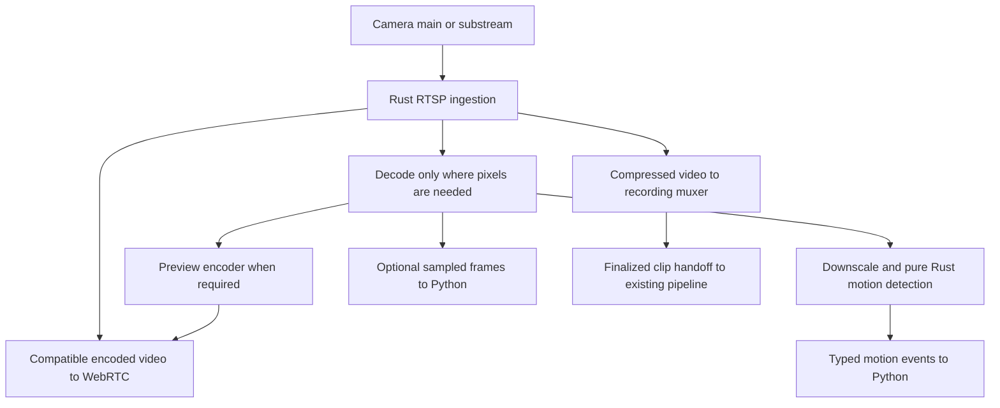

# Shared Rust camera media engine

Ticket: https://app.notion.com/p/3efd8336c59f8195b6b5c50c71c1d5e7

## Context
HomeSec currently opens independent camera inputs for motion detection, recording, and live preview. Motion receives 320x240 grayscale frames at 10 fps through FFmpeg and runs OpenCV frame differencing in Python. Recording copies compressed video into MP4. WebRTC preview uses an FFmpeg child and a Rust/str0m helper.
Leonidas approved a shared Rust media pipeline after discussing compressed-packet sharing, Rust motion detection, optional Python frame delivery, and preserving recording reliability. Established codec libraries remain acceptable initially; an entirely pure-Rust codec stack is a separate evaluation.
The WebRTC foundation is merged in https://github.com/lan17/homesec/pull/109. This is a new implementation initiative; completed HLS/session-ownership tickets remain historical context.

## Architecture
The existing RTSP source/runtime boundary remains the application-facing owner. A supervised camera-local Rust media component owns ingestion and bounded media consumers. Python keeps authorization, application policy, repository writes, upload, and analysis orchestration.

- Share one ingestion session per selected camera stream. Preserve main/substream selection; a low-resolution detection stream can cost less than decoding the main stream.
- Preserve compressed-video copying for recording. Do not force recording through decoded frames or preview transcoding.
- Reuse decoded frames where consumers need the same source; pure Rust motion preserves current blur, threshold, percentage, reset, and recording-sensitivity semantics.
- Python normally receives motion events, health, and completed clip references. Add bounded binary sampled-frame delivery only for a concrete analysis consumer; keep it separate from JSON control. Do not introduce C FFI between Python and Rust.
- Slow preview, motion, or Python consumers must not block recording. Bound memory and consumer queues; recover dropped compressed preview data at a valid keyframe.
- Recording overload or storage failure must be explicit. Correct GOP boundaries, SPS/PPS changes, timestamps, audio synchronization, MP4 finalization/rotation, reconnects, cancellation, and process death are required before migrating recording.
- A shared worker introduces failure coupling. Keep preview encoding failures isolated from the recording path and retain per-camera supervision. Recording/upload must continue independently of Postgres.
- Credentials, SDP, media frames, and tokens are not logged or persisted as diagnostics. Expose stable bounded refusal/error codes and sanitized operational metadata.
- Codec implementations and packaging are distinct from orchestration. Evaluate existing native codec libraries and hardware support before selecting a binding; do not rewrite H.264/H.265/Opus codecs as a prerequisite.

## Plan
1. Native Rust ingest, first PR: replace FFmpeg ingestion for existing video-only H.264 copy-mode WebRTC preview. Reuse video_codec=copy and audio_enabled=false; other configurations retain existing behavior. Use a maintained RTSP client rather than hand-written auth/session logic. Deliver access units and SDP parameter sets to the existing str0m multi-viewer path through a bounded cancellable source adapter. Validate actual source codec/profile against negotiation; handle non-default RTP payload types and SDP-only SPS/PPS. No new UI/API configuration or recording changes.
2. Decode and Rust motion: feed the native encoded source into an established decoder; implement the current motion algorithm in Rust and compare behavior against fixtures from the Python/OpenCV implementation. Preserve reset, camera reconnect, sensitivity, stall grace, and recording policy. Emit typed observations through the existing source/runtime boundary.
3. Shared recording: add compressed packet fanout and recording muxing with independent consumer budgets. Validate keyframe starts, timestamps, audio, rotation, crash recovery, and disk errors before switching production recording. Resolve the RTSP control-response size limitation described below before coupling recording to this input. Keep a rollback path during migration.
4. Preview and Python reuse: share decode/encode work where compatible; allow sampled Python frames for an actual consumer. Support compatible H.264 passthrough and transcode other formats without compromising recordings.
5. Package and validate: reproducible supported-platform builds, required-codec capability checks, redacted errors, and a real-camera trial with recording, motion, and two viewers. Compare session counts, CPU/RSS, start time, and source-to-display latency against the current implementation.

## First PR acceptance
- A fake TCP RTSP camera feeds two encrypted WebRTC receivers through one RTSP PLAY session without invoking FFmpeg.
- SDP-only SPS/PPS and a payload type other than 96 are handled.
- Unsupported codec/profile is refused safely; disconnect, stall, explicit stop, and parent EOF release the camera session.
- Source startup/read cannot block helper control, authorization lease expiry, or shutdown.
- Python chooses native ingest only for supported copy/video-only configuration; transcode/audio paths remain covered.
- Existing recording and runtime regressions pass; run make check before publishing.

## Overall acceptance
- One input per selected stream serves concurrent consumers with measured session counts.
- Recording retains original compressed video and remains healthy when preview/Python is slow or absent.
- Motion behavior is validated against current fixtures; codec changes and real cameras are explicitly tested.
- No claim of a fully FFmpeg-free stack or universal hardware acceleration without separate validation.

## Implementation Log
- 2026-10-03: Leonidas authorized this architecture and staged implementation in a new PR. Inspected existing source, motion, recording, WebRTC, build, tests, and prior Notion tickets. Created branch codex/shared-rust-media from current main after verifying the WebRTC PR is merged. First milestone is native H.264 video-only preview ingestion; later milestones remain planned.
- 2026-10-03: Implemented native RTSP/TCP ingest behind the existing copy/video-only selector, shared with WebRTC viewers through bounded media assembly and queues. Reviewed startup/cancellation and source-profile negotiation; a mixed receiver-level regression now verifies selection of the compatible offered codec. Added real fake-camera delivery, stall, cleanup, and media-loss coverage.

## Validation
`make check` covers Python tests, UI tests, Rust unit and encrypted-media integration tests, strict typing, formatting, lint, lockfile validation, and the UI build. Tests use synthetic camera media and an isolated disposable local Postgres instance. Real-camera rollout and shared motion/recording validation remain later milestones; production Lenovo and its database were not changed.

## First milestone limitation
The adapter uses Retina's packet stream with HomeSec's bounded H.264 assembler rather than Retina's unbounded access-unit demuxer. Media assembly and consumer queues are bounded. Retina 0.4.20's RTSP control-response parser does not expose a byte cap, however; response reads have deadlines but malicious oversized headers/bodies can still grow memory until the deadline. This first opt-in preview mode is for operator-configured cameras on a trusted LAN/VPN. Add an upstream response-size limit before migrating shared recording; do not describe the entire process as having a hard memory bound.

## Links
- WebRTC foundation: https://github.com/lan17/homesec/pull/109
- Related completed RTSP ownership work: https://app.notion.com/p/340d8336c59f8166ad71ff93ce78517d
- Related completed RTSP fanout epic: https://app.notion.com/p/341d8336c59f812595cbdc184c4092ac
- RTSP library: https://github.com/scottlamb/retina
